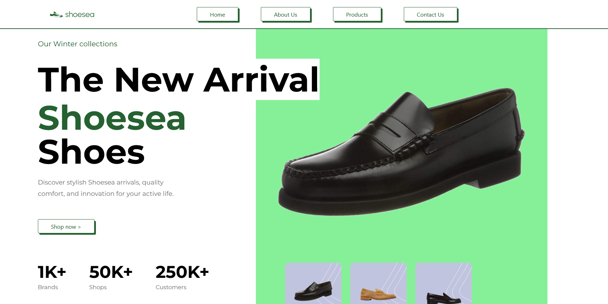

# Shoesea - E-commerce Landing Page

## Description ✍🏻

**Shoesea** est une landing page e-commerce que j'ai réalisée avec **React** et **Tailwind CSS**.✨
   
 
Ce projet marque mon premier exercice avec Tailwind, un framework CSS utilitaire, et dont j'ai constaté une nette progression significative de la vitesse de développement d'interfaces utilisateur, depuis que j'utilise ce Framework !📊
   
L'objectif de cette page était de mettre en avant une gamme de chaussures avec une interface soignée, rapide à charger et facilement personnalisable, tout en apprenant en pratiquant

## Les Fonctionnalités de mon projet ⚙️

- **Page de présentation des produits** : Affichage des chaussures avec une mise en page claire et responsive
- **Responsive Design** : Adaptation de l'interface sur différents appareils grâce à Tailwind
- **Performance améliorée** : Grâce à l'utilisation de Tailwind, mes processus de stylisme et de développement vont accélérer
- **Composants réutilisables** : Utilisation de React pour assurer une structure modulaire et flexible sur mon projet

## Les Technos que j'ai utilisé </>

- **React** : Pour la gestion des composants et des états
- **Tailwind CSS** : Pour le stylisme rapide et performant des éléments de l'interface
- **Magic UI** : Pour les animations

          

  # Shoesea - E-commerce Landing Page

## Description ✍🏻

**Shoesea** is an e-commerce landing page I created using **React** and **Tailwind CSS**.✨
   
 
This project marks my first exercise with Tailwind, a utility-first CSS framework, and I've noticed a significant improvement in the speed of UI development since I started using it!📊
   
The goal of this page was to showcase a range of shoes with a sleek, fast-loading, and easily customizable interface while learning through hands-on practice.

## Features of My Project ⚙️

- **Product Showcase Page**: Displaying shoes with a clear and responsive layout
- **Responsive Design**: Adapting the interface across different devices using Tailwind
- **Enhanced Performance**: By using Tailwind, my styling and development processes are faster
- **Reusable Components**: Using React to ensure a modular and flexible structure for my project

## Technologies Used </>

- **React**: For component and state management
- **Tailwind CSS**: For fast and efficient styling of UI elements
- **Magic UI**: For animations

        

## Available Scripts

In the project directory, you can run:

### `npm start`

Runs the app in the development mode.\
Open [http://localhost:3000](http://localhost:3000) to view it in your browser.

The page will reload when you make changes.\
You may also see any lint errors in the console.

### Deployment

This section has moved here: [https://facebook.github.io/create-react-app/docs/deployment](https://facebook.github.io/create-react-app/docs/deployment)

### `npm run build` fails to minify

This section has moved here: [https://facebook.github.io/create-react-app/docs/troubleshooting#npm-run-build-fails-to-minify](https://facebook.github.io/create-react-app/docs/troubleshooting#npm-run-build-fails-to-minify)
